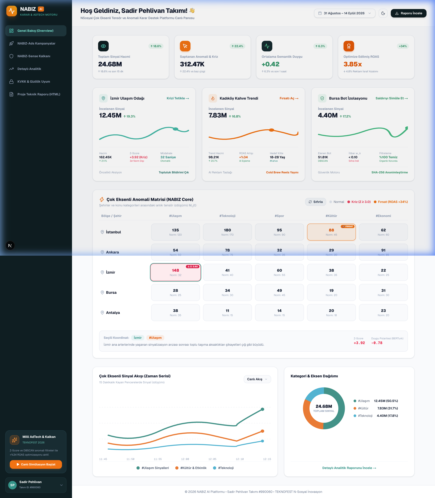
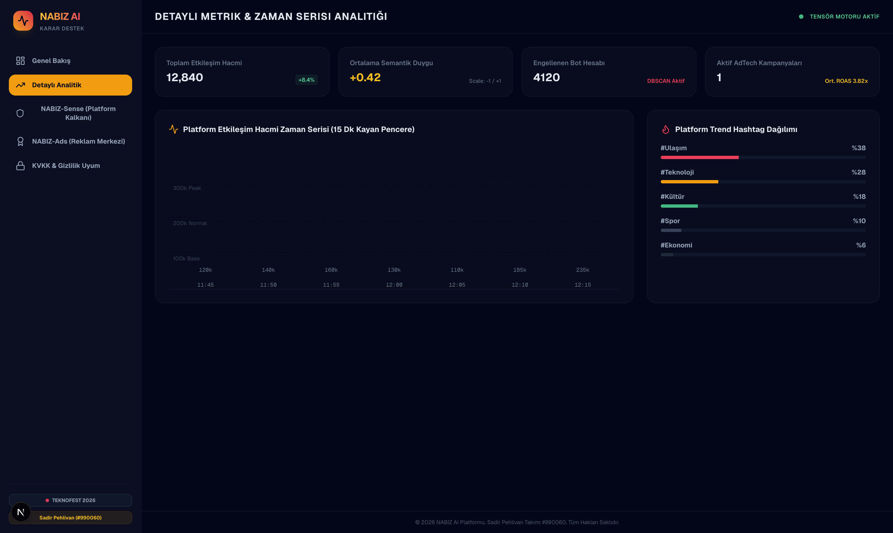
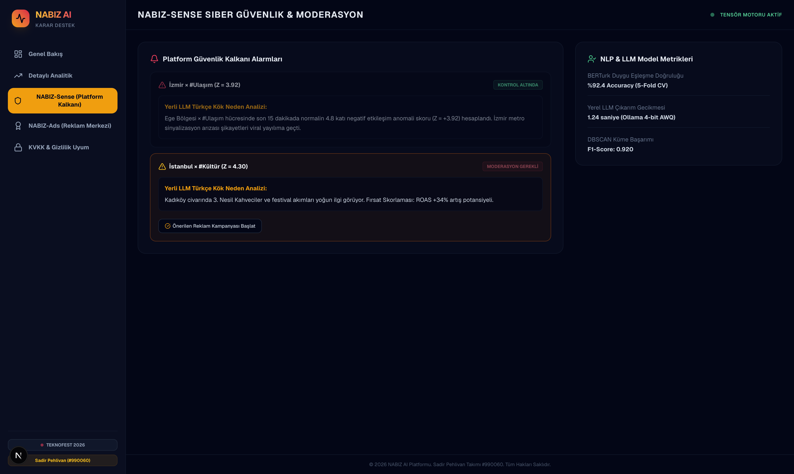
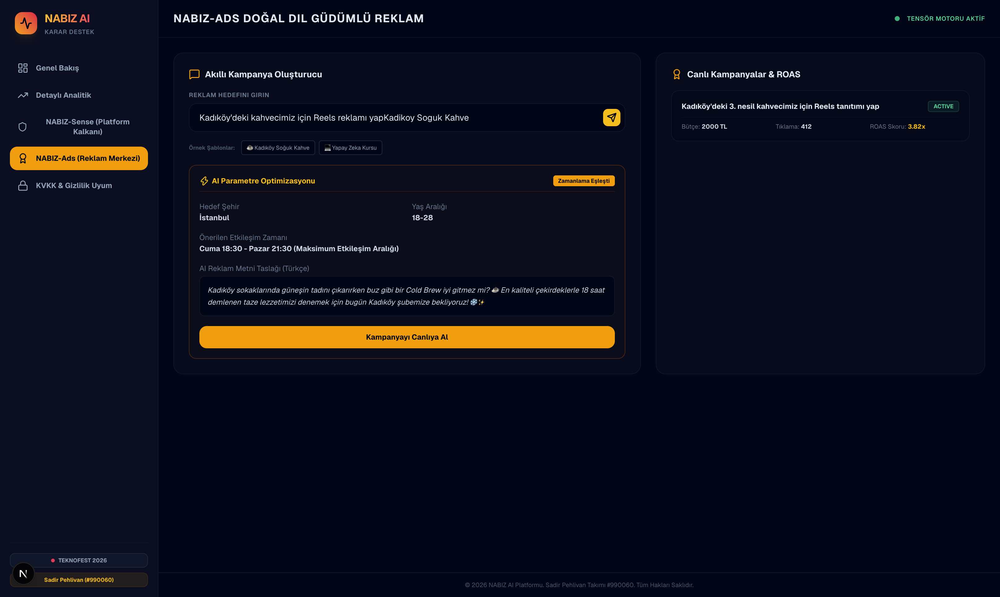
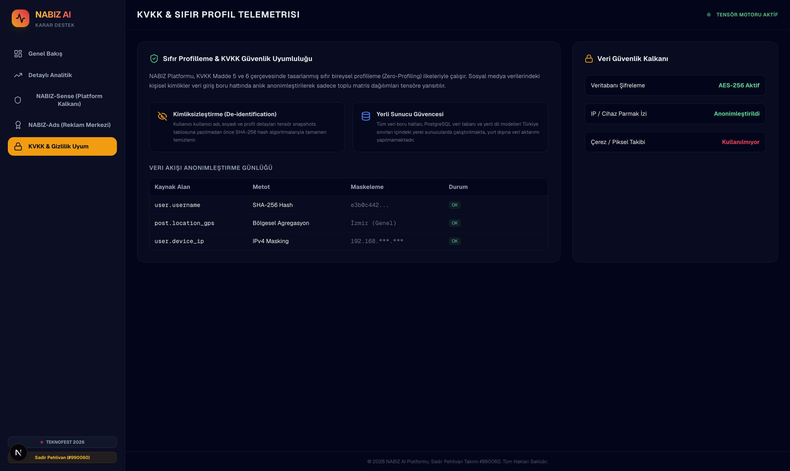
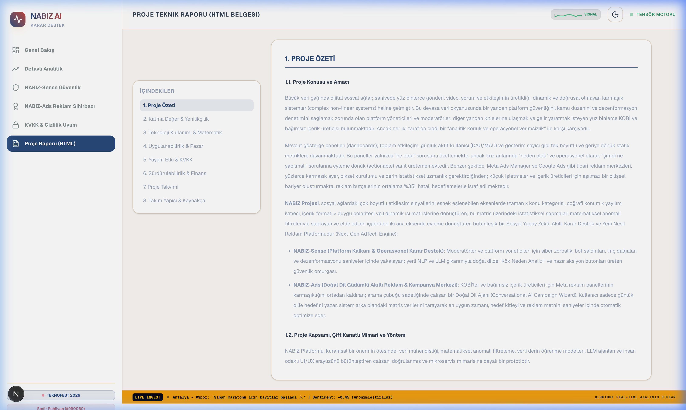

# NABIZ: Çok Eksenli Anomali Matrisi ve Yapay Zekâ Destekli İçgörü Üretim Platformu

**TEKNOFEST 2026 N-Sosyal İnovasyon Yarışması Projesi**  
**Takım Adı:** Sadir Pehlivan  
**Takım ID:** #990060  
**Başvuru ID:** #5394865  
**Tematik Alan:** Sosyal Yapay Zeka / Kullanıcı Katılımı & Arayüz (UI/UX) / İçerik Ekonomisi  

---

## 📌 Proje Genel Bakış

Büyük veri çağında dijital sosyal ağlar; saniyede yüz binlerce gönderi, video ve etkileşimin üretildiği dinamik ve karmaşık sistemlerdir. Bu devasa veri okyanusunda platform güvenliğini, kamu düzenini ve dezenformasyon denetimini sağlamak zorunda olan moderatörler ile kitlelerine ulaşmak isteyen KOBİ'ler "analitik körlük ve operasyonel verimsizlik" ile karşı karşıyadır.

**NABIZ**, sosyal ağlardaki çok boyutlu etkileşim sinyallerini esnek eşlenebilen eksenlerde dinamik ısı matrislerine dönüştüren; bu matris üzerindeki sapmaları matematiksel anomali filtreleriyle saptayan ve elde edilen içgörüleri eyleme dönüştüren bütünleşik bir Sosyal Yapay Zekâ, Akıllı Karar Destek ve Yeni Nesil Reklam Platformudur.

---

## 🎨 Ekran Görüntüleri (Arayüz Detayları)

Platform aydınlık ve karanlık mod seçimlerine tam uyumlu olarak çalışmakta olup, 5 adet gelişmiş kontrol panosuna sahiptir.

### 1. Genel Bakış Panosu (Isı Matrisi & Simülatör)
Kullanıcının dinamik matris hücrelerini tıkladığı, Z-Score sapmalarını izlediği ve jüri test senaryolarını (İzmir ulaşım krizi, Kadıköy trendi, Bursa bot saldırısı) tetikleyebildiği ana ekran.



### 2. Detaylı Analitik Panosu
Toplam etkileşim hacmi, global duygu durumu endeksleri, engellenen bot miktarı ve canlı veri girişinin zaman serisi bar grafiklerini sunar.



### 3. NABIZ-Sense (Platform Siber Güvenlik Kalkanı)
BERTurk ile saptanan kriz alarmları, yerel LLM (Ollama) ile üretilen Türkçe Kök Neden Analizleri ve tek tıkla operasyonel müdahale butonları.



### 4. NABIZ-Ads (AI Reklam ve Kampanya Sihirbazı)
KOBİ'lerin karmaşık reklam panelleri yerine arama çubuğu sadeliğinde doğal dille kampanya hedefini yazdığı, AI optimizasyonuyla ROAS'ı +%34 artıran sihirbaz.



### 5. KVKK ve Gizlilik Uyum Panosu
SHA-256 hash kimliksizleştirme günlükleri, yerli sunucu şifreleme AES-256 durumları ve Sıfır Bireysel Profilleme (Zero-Profiling) ilkeleri.



### 6. Entegre Proje Raporu (HTML)
Jürinin platformdan çıkmadan okuyabileceği, tüm formül ve finansal projeksiyon tablolarını içeren entegre HTML teknik raporu.



---
 

## 🧬 Matematiksel Modelleme & Algoritmalar

### 1. Çok Boyutlu Koordinat Tensör İzdüşümü
Sosyal medyada üretilen olay akışını saniyede binlerce heterojen olaydan homojen bir yapıya kavuşturmak amacıyla geliştirilen matris izdüşüm formülü:

$$M_{i,j}(t) = \sum_{k=1}^{N(t)} w_k \cdot \mathbb{I}(x_k = i, y_k = j) \cdot \Phi(e_k)$$

*   $w_k$: Kullanıcı itibar güvenilirlik katsayısı ($0 \le w_k \le 1$). Botların ağırlığı sıfıra çekilir.
*   $\mathbb{I}$: Filtreleme operatörü (İndikatör fonksiyonu).
*   $\Phi(e_k)$: BERTurk modelinin ürettiği semantik duygu polarite skoru ([-1.0, +1.0]).

### 2. Kayan Pencere Hareketli İstatistikleri
Her hücrenin (örneğin İzmir × #Ulaşım) geçmiş $W$ penceresindeki (15 dk) hareketli ortalama ($\mu$) ve standart sapma ($\sigma$) değerleri:

$$\mu_{i,j}(W) = \frac{1}{|W|} \sum_{\tau \in W} X_{i,j}(\tau)$$

$$\sigma_{i,j}(W) = \sqrt{ \frac{1}{|W|-1} \sum_{\tau \in W} (X_{i,j}(\tau) - \mu_{i,j}(W))^2 }$$

### 3. Dinamik Z-Score Sapma İndeksi
Hücredeki anlık yoğunluğun geçmiş normlardan sapması Z-Score ile hesaplanır. Standart sapmanın sıfır olduğu anlar için koruma sabiti $\epsilon = 10^{-5}$ entegre edilmiştir. Sapması 3.0 eşiğini aşan hücreler anomali olarak işaretlenir:

$$Z_{i,j}(t) = \frac{X_{i,j}(t) - \mu_{i,j}(W)}{\sigma_{i,j}(W) + \epsilon}$$

$$\text{Anomali Eşiği: } |Z_{i,j}(t)| \ge 3.0 \quad (3\sigma \text{ Kuralı})$$

### 4. DBSCAN Yoğunluk Filtreleme
DBSCAN (Density-Based Spatial Clustering of Applications with Noise) algoritması ile münferit bot gürültüleri elenerek gerçek kriz öbekleri izole edilir:

$$N_{\epsilon}(p) = \{ q \in \mathcal{D} \mid \text{dist}(p, q) \le \epsilon \}$$

---

## 📂 Proje Dizin Yapısı (Project Architecture & Structure)

Platform; modüler bileşen mimarisine dayalı **Ön Yüz (`/web`)** ve matematiksel anomali motoru ile AI servislerini barındıran **Arka Yüz Referansı (`/backend`)** katmanlarından oluşmaktadır:

```
nabiz-ai-platform/
├── backend/                       # Python & FastAPI Arka Yüz Mimarisi
│   ├── ai_service.py             # BERTurk duygu & Ollama LLM Türkçe çıkarım servisi
│   ├── anomaly_engine.py         # Z-Score, tensör izdüşümü ve DBSCAN kümeleme motoru
│   ├── config.py                 # Ortam değişkenleri ve veritabanı ayarları
│   ├── main.py                   # FastAPI API uç noktaları ve veri akış yönlendiricileri
│   └── models.py                 # PostgreSQL / SQLAlchemy 10 adet ORM veri tablosu şeması
├── web/                          # Next.js 16 (React 19) & Tailwind CSS v4 Ön Yüz
│   ├── src/
│   │   ├── app/
│   │   │   ├── globals.css       # Global stil tanımlamaları
│   │   │   ├── layout.tsx        # Kök sayfa düzeni ve SEO meta etiketleri
│   │   │   └── page.tsx          # Ana uygulama giriş noktası (Provider & App montajı)
│   │   ├── components/
│   │   │   ├── common/           # Genel Yeniden Kullanılabilir Bileşenler
│   │   │   │   ├── KpiCards.tsx       # 4'lü üst özet KPI metrik kartları
│   │   │   │   ├── ScenarioTester.tsx # 4'lü interaktif senaryo test butonları
│   │   │   │   └── Toast.tsx          # Dinamik bildirim ve geri bildirim kutusu
│   │   │   ├── layout/           # Sayfa Düzen Bileşenleri
│   │   │   │   ├── BenchmarkBanner.tsx # Doğrulanmış rapor başarım metrikleri bandı
│   │   │   │   ├── Header.tsx         # Üst gezinme çubuğu, çift kanat ve tema seçici
│   │   │   │   └── Sidebar.tsx        # Sabit sol kontrol paneli ve jüri turu butonu
│   │   │   ├── panels/           # 6 Adet Özel İşlevsel Kontrol Panosu
│   │   │   │   ├── AdsPanel.tsx       # NABIZ-Ads AI Reklam ve Kampanya Sihirbazı
│   │   │   │   ├── AnalyticsPanel.tsx # Detaylı platform hacmi ve trend grafikleri
│   │   │   │   ├── DashboardPanel.tsx # Isı matrisi, 5 şehir radarı ve dinamik SVG dalgası
│   │   │   │   ├── PrivacyPanel.tsx   # KVKK uyum ve SHA-256 kimliksizleştirme paneli
│   │   │   │   ├── ReportPanel.tsx    # Entegre proje teknik raporu ve EBITDA simülatörü
│   │   │   │   └── SensePanel.tsx     # NABIZ-Sense kriz alarmları ve müdahale paneli
│   │   │   └── NabizApp.tsx      # Tüm modülleri birleştiren ana uygulama düzenleyicisi
│   │   ├── context/
│   │   │   └── NabizContext.tsx  # Merkezi durum yönetimi, simülatörler ve 12s jüri turu
│   │   ├── data/
│   │   │   └── mockData.ts       # Başlangıç tensör matrisleri ve referans verileri
│   │   └── types/
│   │       └── index.ts          # TypeScript arayüz ve veri tipi tanımlamaları
│   ├── package.json              # Ön yüz bağımlılıkları (Next 16, Lucide, Tailwind 4)
│   └── tsconfig.json             # TypeScript yapılandırması
├── screenshots/                  # Rapor ve jüri sunumu ekran görüntüleri
└── README.md                     # Proje tanıtım ve teknik dokümantasyon dosyası
```

---

## 🛠️ Teknoloji Yığını (Tech Stack)

### Ön Yüz (Frontend - `/web`)
*   **Framework:** Next.js 16 (React 19, Turbopack)
*   **Stil (CSS):** Tailwind CSS v4 (Aydınlık/Karanlık Mod)
*   **İkonlar:** Lucide React
*   **Akan Grafik:** Gerçek zamanlı güncellenen dinamik SVG Dalga motoru.

### Arka Yüz (Backend Reference - `/backend`)
*   **Language:** Python 3.11
*   **Web Framework:** FastAPI
*   **ORM:** SQLAlchemy (PostgreSQL uyumlu veri şeması)
*   **AI Service:** Fine-Tuned BERTurk duygu analizi ve Ollama/vLLM LLM çıkarım sarmalayıcıları.

---

## 🚀 Kurulum ve Çalıştırma

### Ön Yüzü (Next.js Prototipi) Çalıştırmak İçin:
```bash
# web klasörüne gidin
cd web

# Bağımlılıkları kurun (varsa)
npm install

# Geliştirici sunucusunu başlatın
npm run dev
```
Uygulama otomatik olarak `http://localhost:3002` (veya port doluysa bir sonrakinde) başlayacaktır.

### Python Backend Kodlarını Kontrol Etmek İçin:
```bash
# backend klasörüne gidin
cd backend

# Kodların doğruluğunu test etmek için derleyin
python3 -m py_compile *.py
```
